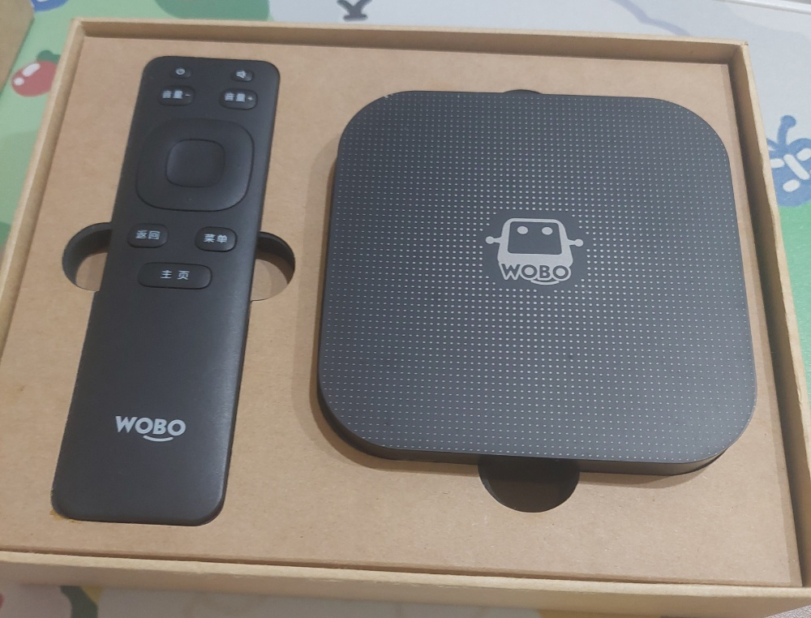
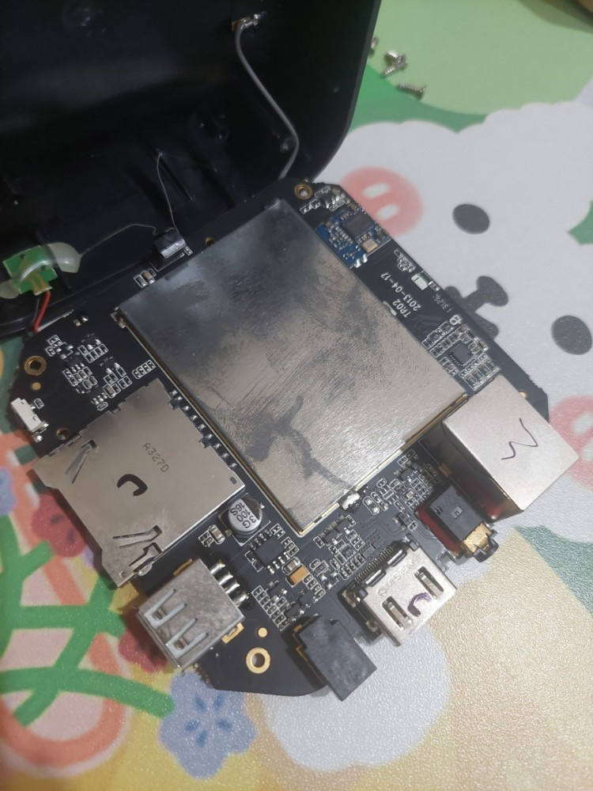
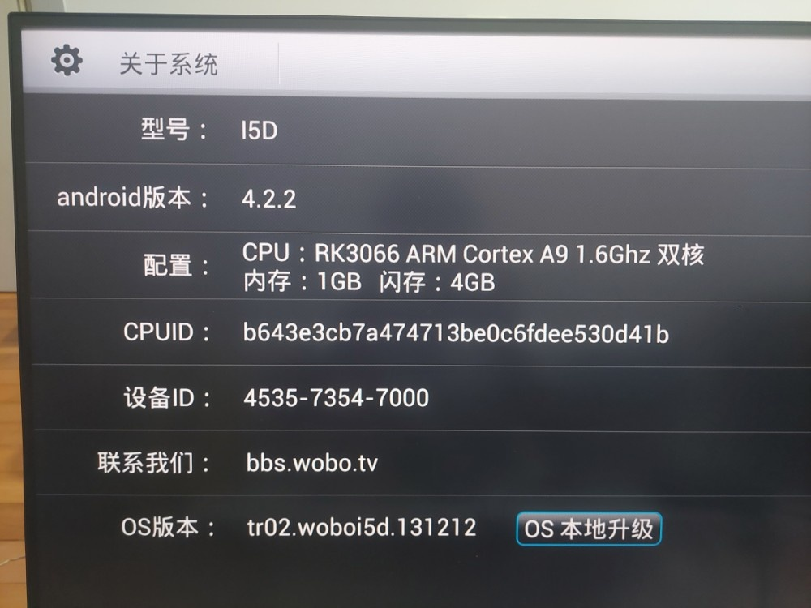
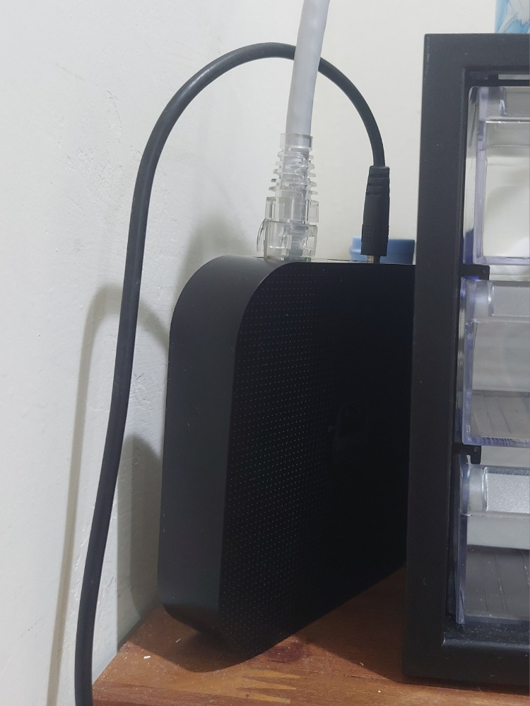
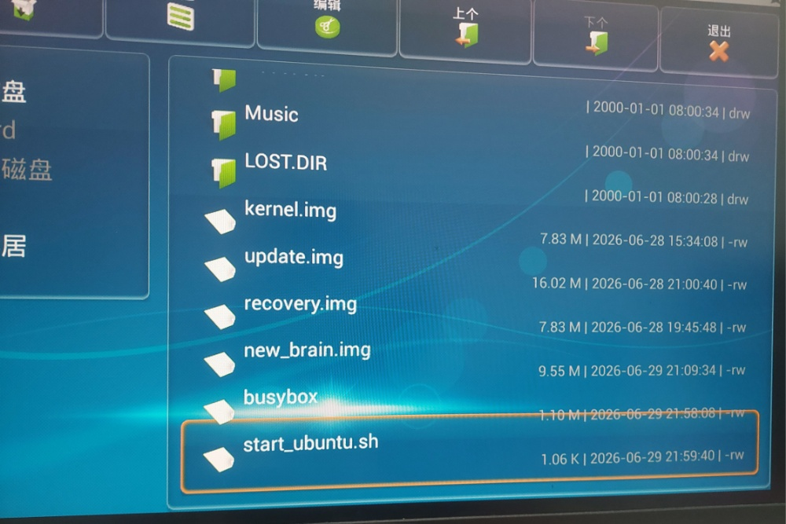

# 🚀 RK3066 TV-Box 改裝 Debian 無頭伺服器（Headless Server）全攻略

本專案紀錄如何將一台搭載 Rockchip RK3066 晶片的舊款 Android 電視盒，徹底閹割其表層 UI 系統，並透過 `chroot` 技術注入完整的 Debian 內核，將其打造成一台 24 小時不間斷運作、具備開機自啟動、遠端 SSH 穿隧與 PM2 行程守護的環境友善型微型伺服器。

---

## 📸 改裝成果與硬體外觀

### 1. 實體外觀與硬體拆解
本改裝基於主流的 RK3066 機型，其硬體外觀與內部 PCB 電路板配置如下：

<p align="center">
  <figure align="center">
    
    <figcaption>圖一：WOBO 電視盒外觀與專屬遙控器</figcaption>
  </figure>
  <br />
  <figure align="center">
    
    <figcaption>圖二：電視盒內部 PCB 主板拆解與元件布局（2013-04-17 版本）</figcaption>
  </figure>
</p>

### 2. 原始系統規格資訊
原廠系統為極舊的 Android 4.2.2 版本，內核為 Linux 3.0.36+，硬體配置為 **RK3066 雙核 Cortex-A9 1.6Ghz CPU / 1GB RAM / 4GB Flash**：

<p align="center">
  
</p>

### 3. 最終無頭伺服器（Headless）運作型態
拔除所有 HDMI 螢幕輸出，改為直插 RJ45 網路線與電源，實現 0% 額外圖形效能浪費的冷酷伺服器狀態：

<p align="center">
  
</p>

---

## 🛠️ RK3066 刷機與改裝工具大補帖

在進行軟體修改前，需準備好以下傳統 Rockchip 開發工具鏈（建議在 Windows 7 或 Windows 10/11 相容模式下執行）：

1. **Rockchip DriverAssistant (瑞芯微驅動助理)**：用於讓 Windows 電腦能透過物理 USB 線識別處於 LOADER 或 MASKROM 模式下的電視盒。
2. **RKBatchTool 或 RKDevelopTool**：用於燒錄自定義的 Linux/Ubuntu/Debian 固件鏡像（Image）至電視盒的 NAND Flash 中。
3. **Android SDK Platform-Tools (ADB 工具)**：用於在 Android 表層系統未崩潰前，進行遠端偵錯、權限提權與檔案傳輸。
4. **Busybox 靜態編譯版 (ARMv7 構架)**：由於 Android 內建的 Toolbox 指令極度閹割，必須將 `busybox` 推入 `/data/local/tmp/` 以提供完整的 `mount`、`sed`、`dos2unix` 等 Linux 核心指令支援。

### 核心鏡像與引導腳本部署結構

<p align="center">
  
</p>

---

## ⚙️ 核心自動化點火腳本：`start_ubuntu.sh`

這是整個改裝專案的靈魂。當 Android 系統啟動時，會藉由本腳本完成 Linux 核心神經網路掛載、DNS 注入、環境變數隔離，並發動 `chroot` 靈魂轉移，最後喚醒守護進程。

請將此腳本放置於 Android 系統的 `/data/local/tmp/start_ubuntu.sh`（或永久儲存區 `/data/`）：

```bash
#!/system/bin/sh

# 定義 Debian 根目錄在 Android 系統中的掛載路徑
export UBUNTU_ROOT=/mnt/ubuntu_test/debian8

# 1. 掛載 Linux 核心系統虛擬目錄
/data/local/tmp/busybox mount -o bind /dev $UBUNTU_ROOT/dev 2>/dev/null
/data/local/tmp/busybox mount -o bind /proc $UBUNTU_ROOT/proc 2>/dev/null
/data/local/tmp/busybox mount -o bind /sys $UBUNTU_ROOT/sys 2>/dev/null

# 2. 掛載虛擬終端設備 (PTY)，獨立生成終端機，避免與 Android 底層衝突
/data/local/tmp/busybox mount -t devpts devpts $UBUNTU_ROOT/dev/pts 2>/dev/null

# 3. 注入穩定之 DNS 設定
echo "nameserver 8.8.8.8" > $UBUNTU_ROOT/etc/resolv.conf

# 4. 發動 Chroot 靈魂轉移，進入 Debian 環境
echo "Starting Ubuntu Safely..."
/data/local/tmp/busybox chroot $UBUNTU_ROOT /bin/bash -c "
  # 建立完整的 root 環境變數導航系統 (確保 Node.js 與 PM2 能正確定位)
  export PATH=/usr/local/sbin:/usr/local/bin:/usr/sbin:/usr/bin:/sbin:/bin
  export HOME=/root
  export USER=root
  export PM2_HOME=/root/.pm2

  # 喚醒本機虛擬網路與 SSH 遠端安全連線服務
  ifconfig lo up
  /etc/init.d/ssh start || service ssh start

  # 喚醒 PM2 守護進程 (自動拉起 Cloudflare Tunnel 與背景服務)
  echo 'Starting PM2 Daemon...'
  pm2 resurrect || /usr/local/bin/pm2 resurrect

  echo '==================================='
  echo '  SYSTEM BOOT SEQUENCE COMPLETED   '
  echo '  SSH and PM2 Services are ONLINE  '
  echo '==================================='
"
```

---

## 🧠 技術原理深度解析

### 1. 什麼是 `chroot`？與虛擬機有何不同？
`chroot`（Change Root）是 Linux 內建的一種輕量級隔離技術。它不需要像 Docker 或傳統虛擬機（VM）那樣模擬整套硬體驅動，而是**直接共用 Android 系統的 Linux 內核（Kernel）**，但將某個特定資料夾（本例中為 `/mnt/ubuntu_test/debian8`）指定為新的系統根目錄 `/`。
這使得老舊的 RK3066 雙核處理器不需要承擔虛擬化的效能損耗，就能以接近 **0% 的額外 CPU 開銷** 執行完整的 Debian Linux 生態圈。

### 2. 斬首行動：為何必須物理閹割 Android UI 桌面？
Android 系統的圖形渲染層（SurfaceFlinger）與原廠桌面啟動器（Launcher）會持續消耗極大的記憶體（RAM）與 CPU 運算資源。為了將硬體效能完全榨乾給後端服務使用，必須將其轉化為「無頭伺服器（Headless）」。
* **技術陷阱**：直接使用 `pm disable` 停用原廠 Launcher 時，可能會觸發 Android 底層 `/init` 進程的保護機制。當 `/init` 偵測到核心系統 UI 消失，會以每秒數千次的頻率嘗試重啟服務，導致系統陷入**「恐慌迴圈 (Panic Loop)」**，使 `kconsole` 被錯誤日誌塞爆，進而讓 CPU 飆升至 100%。
* **正確解法**：解除系統槽防寫保護（`mount -o rw,remount /system`），將原廠 Launcher 的 APK 實體檔案進行改名備份（例如將 `.apk` 改為 `.apk.bak`），清空記憶體殘留，迫使系統完全放棄圖形層，釋放全面運算力。

### 3. 全球無死角遠端連線：Cloudflare Tunnel 的 SSH 安全穿透
由於多數家用環境處於內網（NAT），無固定公網 IP。傳統透過 Port Forwarding（連接埠轉發）具有極高資安風險。
* 本架構採用 `cloudflared` 建立安全加密隧道。電視盒主動向 Cloudflare 伺服器建立雙向安全連線，並將 `ssh://localhost:22` 映射至自定義子網域（如 `ssh.your-domain.com`）。
* **客戶端連線機制**：由於通道經過 Cloudflare 加密封包封裝，客戶端電腦（Windows/Mac）需下載 `cloudflared` 執行檔，並於本地端 `.ssh/config` 設定代理命令：

```text
Host ssh.your-domain.com
    ProxyCommand C:\path\to\cloudflared.exe access ssh --hostname %h
```

如此便能安全地穿透任何防火牆，隨時隨地連線至電視盒。

---

## 🚀 步驟式佈署指南

### 步驟一：空投基礎檔案
透過 Windows CMD 將關鍵的啟動腳本與編譯好的 `busybox` 推送至電視盒：
```bash
adb push start_ubuntu.sh /data/local/tmp/
adb push busybox /data/local/tmp/
adb shell "chmod 777 /data/local/tmp/*"
```

### 步驟二：手動熱線點火測試
避免終端機複製貼上導致緩衝區溢位，請一行一行依序執行：
```bash
adb shell
su
export UBUNTU_ROOT=/mnt/ubuntu_test/debian8
/data/local/tmp/busybox mount -o bind /dev $UBUNTU_ROOT/dev
/data/local/tmp/busybox mount -o bind /proc $UBUNTU_ROOT/proc
/data/local/tmp/busybox mount -o bind /sys $UBUNTU_ROOT/sys
/data/local/tmp/busybox chroot $UBUNTU_ROOT /bin/bash -c "/etc/init.d/ssh start"
```

### 步驟三：靜態網站與排程常駐
進入 Debian 環境後，利用 PM2 內建的輕量級伺服器架設網頁服務，並將狀態寫入常駐名單：
```bash
# 使用 80 通訊埠發佈靜態網站
pm2 serve /root/Your-Web-Folder 80 --name "web-main"

# 儲存目前所有行程（包含自動穿隧、機器人與網頁）
pm2 save
```

### 步驟四：救磚防範機制（牙籤大法）
倘若因修改 Android 系統檔案導致引導卡死、網路中斷：
1. 拔除電源，使用牙籤按住電視盒 `AV 孔` 或 `Reset 孔` 深處的隱藏微動開關。
2. 按住不放並插上電源，持續 15 秒直至螢幕亮起，強制進入 `Android Recovery 模式`。
3. 接上 USB 線，即可透過 `adb shell` 重新掛載系統磁區並修正錯誤檔案。

---

## 📜 授權條款
本專案基於 MIT 授權條款開放，歡迎自由衍生與魔改。
