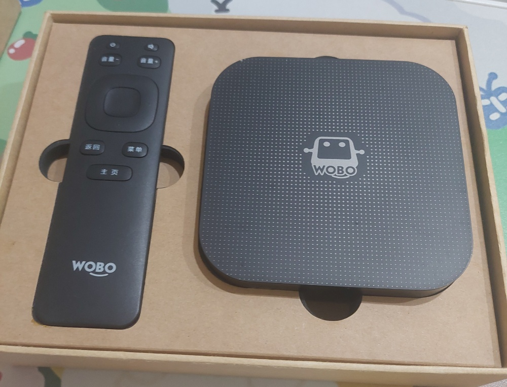
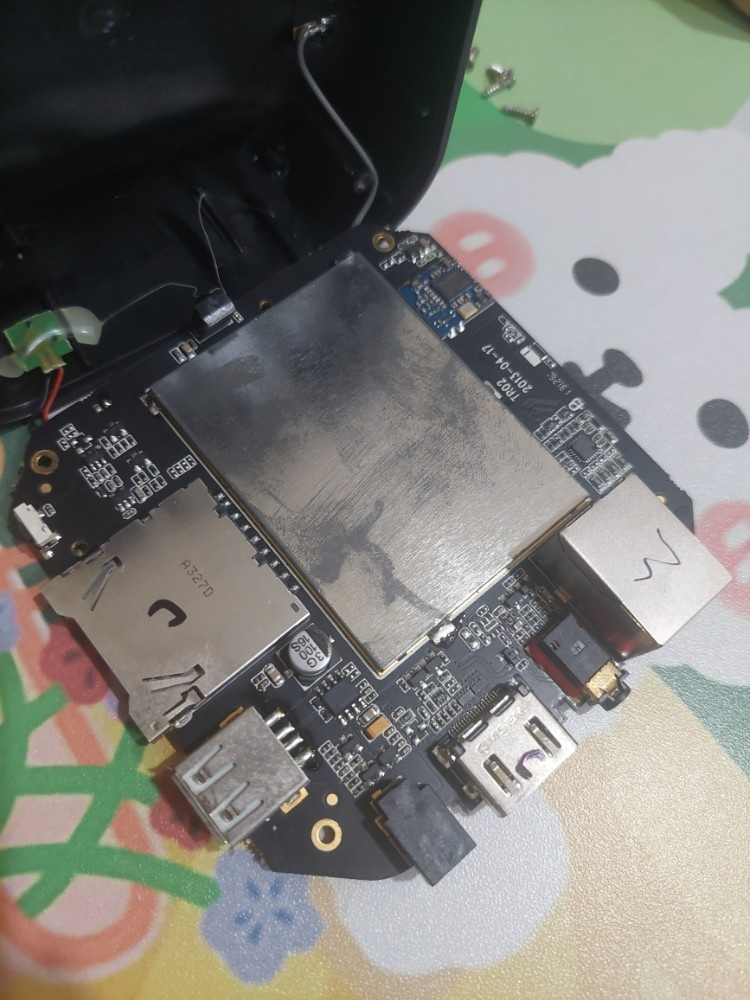
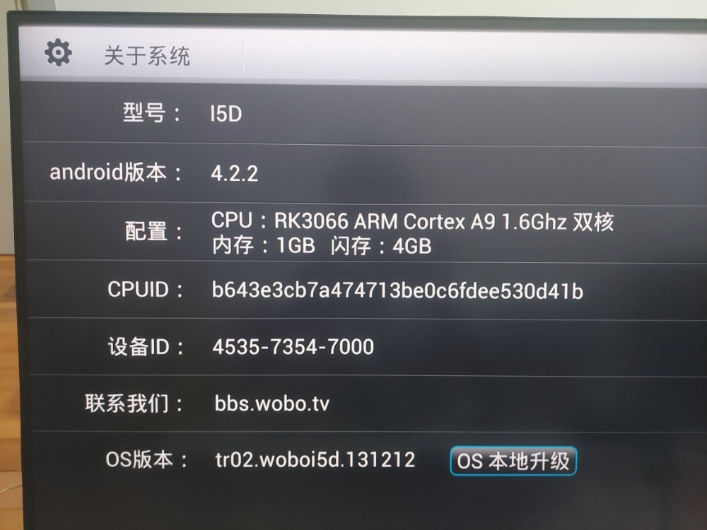
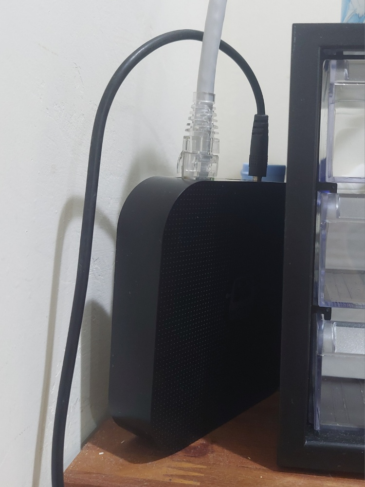
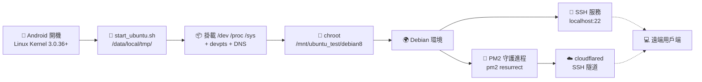
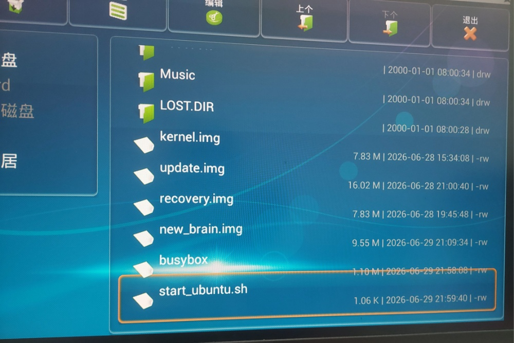

# 🚀 RK3066 TV-Box 改裝 Debian 無頭伺服器（Headless Server）全攻略

[](LICENSE)
[](#gallery)
[](#architecture)
[](#deep-dive)

本專案紀錄如何將一台搭載 Rockchip **RK3066** 晶片的舊款 Android 電視盒，徹底閹割其表層 UI 系統，並透過 `chroot` 技術注入完整的 Debian 環境，將其打造成一台 **24 小時不間斷運作**、具備**開機自啟動、遠端 SSH 穿隧與 PM2 行程守護**的環境友善型微型伺服器。

> 💡 **一句話總結**：把吃灰的舊電視盒，變成低功耗、可全球遠端連線的 Linux 小伺服器。

---

## 📑 目錄

- [📸 改裝成果與硬體外觀](#gallery)
- [📐 專案架構總覽](#architecture)
- [🛠️ 刷機與改裝工具大補帖](#tools)
- [⚙️ 核心自動化點火腳本：start_ubuntu.sh](#script)
- [🧠 技術原理深度解析](#deep-dive)
- [🚀 步驟式佈署指南](#deployment)
- [🧭 改裝前後對比](#comparison)
- [❓ 常見問題與排錯（FAQ）](#faq)
- [⚠️ 風險提示與免責聲明](#disclaimer)
- [📜 授權條款](#license)

---

<a id="gallery"></a>

## 📸 改裝成果與硬體外觀

### 1. 實體外觀與硬體拆解

本改裝基於主流的 RK3066 機型（WOBO I5D），其硬體外觀與內部 PCB 電路板配置如下：

<p align="center">
  
</p>
<p align="center"><em>圖 1：WOBO 電視盒外觀與專屬遙控器</em></p>

<p align="center">
  
</p>
<p align="center"><em>圖 2：電視盒內部 PCB 主板拆解與元件布局（2013-04-17 版本）</em></p>

### 2. 原始系統規格資訊

原廠系統為極舊的 **Android 4.2.2**，內核為 **Linux 3.0.36+**，硬體配置如下：

| 項目 | 規格 |
|:---|:---|
| SoC | Rockchip **RK3066** ARM Cortex-A9 雙核 1.6 GHz |
| 記憶體（RAM） | 1 GB |
| 儲存空間（Flash） | 4 GB NAND |
| 原廠系統 | Android 4.2.2（`tr02.woboi5d.131212`） |
| 內核版本 | Linux 3.0.36+ |
| 網路介面 | RJ45 有線乙太網路 |

<p align="center">
  
</p>
<p align="center"><em>圖 3：原廠 Android「關於系統」頁面截圖</em></p>

### 3. 最終無頭伺服器（Headless）運作型態

拔除所有 HDMI 螢幕輸出，改為直插 **RJ45 網路線與電源**，實現 0% 額外圖形效能浪費的冷酷伺服器狀態：

<p align="center">
  
</p>
<p align="center"><em>圖 4：僅接網路線與電源的無頭運作狀態</em></p>

---

<a id="architecture"></a>

## 📐 專案架構總覽

整個系統的啟動鏈路如下：**Android 底層 → 掛載虛擬目錄 → chroot 進入 Debian → 喚醒 SSH / PM2 → Cloudflare Tunnel 全球穿透**。


```mermaid
flowchart LR
    A["🔌 Android 開機<br/>Linux Kernel 3.0.36+"] --> B["📜 start_ubuntu.sh<br/>/data/local/tmp/"]
    B --> C["📦 掛載 /dev /proc /sys<br/>+ devpts + DNS"]
    C --> D["🔁 chroot<br/>/mnt/ubuntu_test/debian8"]
    D --> E["🌍 Debian 環境"]
    E --> F["🔐 SSH 服務<br/>localhost:22"]
    E --> G["🧵 PM2 守護進程<br/>pm2 resurrect"]
    G --> H["☁️ cloudflared<br/>SSH 隧道"]
    F -.-> I["💻 遠端用戶端"]
    H -.-> I
```

### 核心鏡像與引導腳本部署結構

電視盒儲存區中需就位的關鍵檔案（`kernel.img`、`update.img`、`recovery.img`、`new_brain.img` 等固件鏡像，以及 `busybox` 與 `start_ubuntu.sh` 點火腳本）：

<p align="center">
  
</p>
<p align="center"><em>圖 5：檔案管理器中的引導鏡像與點火腳本部署一覽</em></p>

### 建議的準備檔案清單

| 檔案 | 推送位置 | 用途 |
|:---|:---|:---|
| `start_ubuntu.sh` | `/data/local/tmp/` | 掛載、chroot 與服務點火總指揮 |
| `busybox`（ARMv7 靜態版） | `/data/local/tmp/` | 補齊 Android 缺乏的核心指令 |
| Debian 根檔案系統 | `/mnt/ubuntu_test/debian8/` | chroot 的新系統根目錄 `/` |

---

<a id="tools"></a>

## 🛠️ 刷機與改裝工具大補帖

在進行軟體修改前，需準備好以下傳統 Rockchip 開發工具鏈（建議在 Windows 7 或 Windows 10/11 相容模式下執行）：

- [ ] **Rockchip DriverAssistant（瑞芯微驅動助理）**：讓 Windows 電腦能透過 USB 線識別處於 `LOADER` 或 `MASKROM` 模式下的電視盒。
- [ ] **RKBatchTool 或 RKDevelopTool**：燒錄自定義的 Linux/Ubuntu/Debian 固件鏡像（Image）至電視盒 NAND Flash；亦可用於**備份原廠固件**（強烈建議改裝前先備份）。
- [ ] **Android SDK Platform-Tools（ADB 工具）**：在 Android 表層系統未崩潰前，進行遠端偵錯、權限提權與檔案傳輸。
- [ ] **Busybox 靜態編譯版（ARMv7 架構）**：Android 內建 Toolbox 指令極度閹割，必須將 `busybox` 推入 `/data/local/tmp/`，以提供完整的 `mount`、`sed`、`dos2unix` 等 Linux 核心指令支援。
- [ ] **cloudflared 執行檔**（電視盒端 + 用戶端各一份）：建立 Cloudflare SSH 加密隧道。

---

<a id="script"></a>

## ⚙️ 核心自動化點火腳本：`start_ubuntu.sh`

這是整個改裝專案的靈魂。當 Android 系統啟動時，會藉由本腳本完成 Linux 核心虛擬目錄掛載、DNS 注入、環境變數隔離，並發動 `chroot` 靈魂轉移，最後喚醒守護進程。

請將此腳本放置於 Android 系統的 `/data/local/tmp/start_ubuntu.sh`（或永久儲存區 `/data/`）：

```bash
#!/system/bin/sh

# 定義 Debian 根目錄在 Android 系統中的掛載路徑
export UBUNTU_ROOT=/mnt/ubuntu_test/debian8

# 1. 掛載 Linux 核心系統虛擬目錄
/data/local/tmp/busybox mount -o bind /dev $UBUNTU_ROOT/dev 2>/dev/null
/data/local/tmp/busybox mount -o bind /proc $UBUNTU_ROOT/proc 2>/dev/null
/data/local/tmp/busybox mount -o bind /sys $UBUNTU_ROOT/sys 2>/dev/null

# 2. 掛載虛擬終端設備 (PTY)，獨立生成終端機，避免與 Android 底層衝突
/data/local/tmp/busybox mount -t devpts devpts $UBUNTU_ROOT/dev/pts 2>/dev/null

# 3. 注入穩定之 DNS 設定
echo "nameserver 8.8.8.8" > $UBUNTU_ROOT/etc/resolv.conf

# 4. 發動 Chroot 靈魂轉移，進入 Debian 環境
echo "Starting Ubuntu Safely..."
/data/local/tmp/busybox chroot $UBUNTU_ROOT /bin/bash -c "
  # 建立完整的 root 環境變數導航系統 (確保 Node.js 與 PM2 能正確定位)
  export PATH=/usr/local/sbin:/usr/local/bin:/usr/sbin:/usr/bin:/sbin:/bin
  export HOME=/root
  export USER=root
  export PM2_HOME=/root/.pm2

  # 喚醒本機虛擬網路與 SSH 遠端安全連線服務
  ifconfig lo up
  /etc/init.d/ssh start || service ssh start

  # 喚醒 PM2 守護進程 (自動拉起 Cloudflare Tunnel 與背景服務)
  echo 'Starting PM2 Daemon...'
  pm2 resurrect || /usr/local/bin/pm2 resurrect

  echo '==================================='
  echo '  SYSTEM BOOT SEQUENCE COMPLETED   '
  echo '  SSH and PM2 Services are ONLINE  '
  echo '==================================='
"
```

> 📌 **腳本要點**
>
> | 階段 | 動作 | 目的 |
> |:---|:---|:---|
> | 1️⃣ | `mount -o bind` `/dev` `/proc` `/sys` | 讓 chroot 內看到核心虛擬目錄 |
> | 2️⃣ | `mount -t devpts` | 獨立 PTY，避免與 Android 終端衝突 |
> | 3️⃣ | 寫入 `resolv.conf` | 確保 chroot 內 DNS 可解析 |
> | 4️⃣ | `chroot` + 啟動 SSH / PM2 | 進入 Debian 並拉起所有遠端服務 |

---

<a id="deep-dive"></a>

## 🧠 技術原理深度解析

### 1. 什麼是 `chroot`？與虛擬機有何不同？

`chroot`（Change Root）是 Linux 內建的一種輕量級隔離技術。它不需要像 Docker 或傳統虛擬機（VM）那樣模擬整套硬體驅動，而是**直接共用 Android 系統的 Linux 內核（Kernel）**，但將某個特定資料夾（本例中為 `/mnt/ubuntu_test/debian8`）指定為新的系統根目錄 `/`。

這使得老舊的 RK3066 雙核處理器不需要承擔虛擬化的效能損耗，就能以接近 **0% 的額外 CPU 開銷**執行完整的 Debian Linux 生態圈。

| 隔離方案 | 是否模擬硬體 | 額外開銷 | 適合 1GB RAM 舊盒子？ |
|:---|:---:|:---:|:---:|
| 傳統虛擬機（VM） | ✅ 是 | 高 | ❌ |
| 容器（Docker） | ❌ 否 | 中（需完整 runtime） | ⚠️ 勉強 |
| **`chroot`（本專案）** | ❌ 否 | **極低** | ✅ |

<a id="panic-loop"></a>

### 2. 斬首行動：為何必須物理閹割 Android UI 桌面？

Android 系統的圖形渲染層（SurfaceFlinger）與原廠桌面啟動器（Launcher）會持續消耗極大的記憶體（RAM）與 CPU 運算資源。為了將硬體效能完全榨乾給後端服務使用，必須將其轉化為「無頭伺服器（Headless）」。

- ⚠️ **技術陷阱**：直接使用 `pm disable` 停用原廠 Launcher 時，可能會觸發 Android 底層 `/init` 進程的保護機制。當 `/init` 偵測到核心系統 UI 消失，會以每秒數千次的頻率嘗試重啟服務，導致系統陷入**「恐慌迴圈（Panic Loop）」**，使 `kconsole` 被錯誤日誌塞爆，進而讓 CPU 飆升至 100%。
- ✅ **正確解法**：解除系統槽寫保護（`mount -o rw,remount /system`），將原廠 Launcher 的 APK 實體檔案改名備份（例如 `.apk` 改為 `.apk.bak`），清空記憶體殘留，迫使系統完全放棄圖形層，釋放全部運算力。

### 3. 全球無死角遠端連線：Cloudflare Tunnel 的 SSH 安全穿透

由於多數家用環境處於內網（NAT），無固定公網 IP。傳統透過 Port Forwarding（連接埠轉發）具有極高資安風險。

- 本架構採用 `cloudflared` 建立安全加密隧道：電視盒**主動**向 Cloudflare 伺服器建立雙向安全連線，並將 `ssh://localhost:22` 映射至自定義子網域（如 `ssh.your-domain.com`）。
- **客戶端連線機制**：由於通道經過 Cloudflare 加密封包封裝，客戶端電腦（Windows/Mac）需下載 `cloudflared` 執行檔，並於本地端 `~/.ssh/config` 設定代理命令：

```text
Host ssh.your-domain.com
    ProxyCommand C:\path\to\cloudflared.exe access ssh --hostname %h
```

設定完成後，即可安全地穿透任何防火牆，隨時隨地連線至電視盒：

```bash
ssh root@ssh.your-domain.com
```

---

<a id="deployment"></a>

## 🚀 步驟式佈署指南

### 步驟一：空投基礎檔案

透過 Windows CMD 將關鍵的啟動腳本與編譯好的 `busybox` 推送至電視盒：

```bash
adb push start_ubuntu.sh /data/local/tmp/
adb push busybox /data/local/tmp/
adb shell "chmod 777 /data/local/tmp/*"
```

### 步驟二：手動熱線點火測試

避免終端機整段複製貼上導致緩衝區溢位，請**一行一行**依序執行：

```bash
adb shell
su
export UBUNTU_ROOT=/mnt/ubuntu_test/debian8
/data/local/tmp/busybox mount -o bind /dev $UBUNTU_ROOT/dev
/data/local/tmp/busybox mount -o bind /proc $UBUNTU_ROOT/proc
/data/local/tmp/busybox mount -o bind /sys $UBUNTU_ROOT/sys
/data/local/tmp/busybox chroot $UBUNTU_ROOT /bin/bash -c "/etc/init.d/ssh start"
```

看到 SSH 服務成功啟動後，即可從區域網路以 `ssh root@<電視盒 IP>` 驗證連線。

### 步驟三：靜態網站與排程常駐

進入 Debian 環境後，利用 PM2 內建的輕量級伺服器架設網頁服務，並將狀態寫入常駐名單：

```bash
# 使用 80 通訊埠發佈靜態網站
pm2 serve /root/Your-Web-Folder 80 --name "web-main"

# 儲存目前所有行程（包含自動穿隧、機器人與網頁）
pm2 save
```

之後每次點火腳本執行 `pm2 resurrect`，即可自動還原全部服務。

<a id="rescue"></a>

### 步驟四：救磚防範機制（牙籤大法）

倘若因修改 Android 系統檔案導致引導卡死、網路中斷：

1. 拔除電源，使用牙籤按住電視盒 `AV 孔` 或 `Reset 孔` 深處的隱藏微動開關。
2. 按住不放並插上電源，持續 15 秒直至螢幕亮起，強制進入 `Android Recovery 模式`。
3. 接上 USB 線，即可透過 `adb shell` 重新掛載系統磁區並修正錯誤檔案。

> 💾 **保命建議**：改裝前先用 RKBatchTool 完整備份原廠固件；任何系統檔修改前都先複製一份 `.bak`。

---

<a id="comparison"></a>

## 🧭 改裝前後對比

| 面向 | 改裝前（原廠 Android） | 改裝後（Debian Headless） |
|:---|:---|:---|
| 介面 | 圖形桌面 Launcher + SurfaceFlinger | 無頭純指令列，零圖形開銷 |
| 用途 | 逐漸停更的舊版 Android 影音盒子 | 24/7 微型 Linux 伺服器 |
| 遠端管理 | 僅區域網路 ADB | SSH + Cloudflare Tunnel 全球穿透 |
| 服務常駐 | 無 | PM2 行程守護，`pm2 resurrect` 自動還原 |
| 資源利用 | 大量 RAM/CPU 被 UI 佔用 | 記憶體與算力全數交給後端服務 |
| 虛擬化開銷 | — | `chroot` 共用內核，接近 0% |

---

<a id="faq"></a>

## ❓ 常見問題與排錯（FAQ）

<details>
<summary><b>Q1：啟用腳本後 CPU 100%、錯誤日誌刷個不停？</b></summary>

<br/>

這多半是 **Panic Loop**：使用 `pm disable` 停用 Launcher 觸發了 `/init` 的重啟保護機制。
請改用「改名 APK」法（見[技術原理第 2 節](#panic-loop)），並重開機。
</details>

<details>
<summary><b>Q2：chroot 內無法解析網域名稱？</b></summary>

<br/>

確認點火腳本第 3 步已寫入 DNS：

```bash
echo "nameserver 8.8.8.8" > $UBUNTU_ROOT/etc/resolv.conf
```

若在 chroot 內手動測試，請同時確認 `lo` 網卡已啟用（`ifconfig lo up`）。
</details>

<details>
<summary><b>Q3：執行 mount / chroot 沒反應或報找不到指令？</b></summary>

<br/>

- 確認已使用 `/data/local/tmp/busybox` 前綴呼叫指令（Android 原生 Toolbox 不完整）。
- 確認腳本以 `su`（root 權限）執行。
- 確認 `UBUNTU_ROOT` 路徑與 Debian 根檔案系統實際位置一致。
</details>

<details>
<summary><b>Q4：`pm2` 指令找不到或服務沒被拉起？</b></summary>

<br/>

- 腳本已內建雙路徑嘗試：`pm2 resurrect || /usr/local/bin/pm2 resurrect`。
- 請先在 chroot 內手動執行過一次 `pm2 save`，否則 `resurrect` 沒有進程快照可還原。
- 注意腳本已設定 `PM2_HOME=/root/.pm2`，避免 HOME 環境缺失導致找不到定義檔。
</details>

<details>
<summary><b>Q5：改壞系統開不了機 / 網路中斷怎麼辦？</b></summary>

<br/>

使用**牙籤大法**進入 Recovery 模式（見[步驟四](#rescue)），接 USB 後以 `adb shell` 修正檔案；若有備份原廠固件，亦可透過 RKBatchTool 整包重刷。
</details>

---

<a id="disclaimer"></a>

## ⚠️ 風險提示與免責聲明

- 刷機、修改 `/system` 分區與變更引導檔案**存在變磚風險**，操作前請務必備份原廠固件與重要資料。
- 本專案所有步驟基於特定 RK3066 機型（WOBO I5D）實測，其他型號的分區佈置、Recovery 進入方式可能不同，請自行評估驗證。
- 開放 SSH 與對外隧道屬於高權限操作，請務必改預設密碼、限制可連線來源，並保持 `cloudflared` 與系統更新。
- 本文件僅供學習與技術研究使用，因依本文件操作造成之任何硬體損壞或資料遺失，責任請自行承擔。

---

<a id="license"></a>

## 📜 授權條款

本專案基於 [MIT 授權條款](LICENSE)開放，歡迎自由衍生與魔改。

```
MIT License — free to use, modify, and distribute, with attribution.
```
